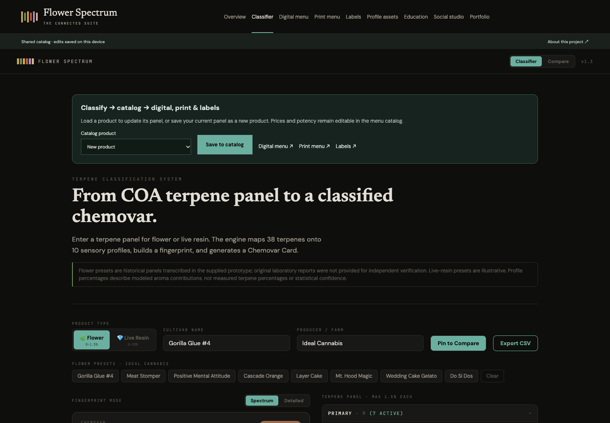
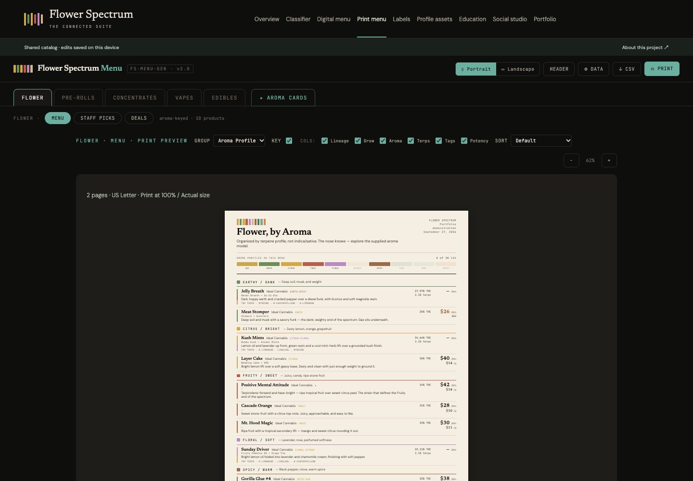
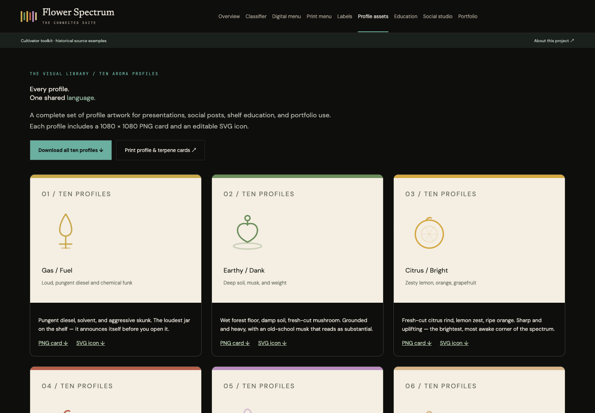

# Flower Spectrum Suite

**[🚀 Live Demo](https://flower-spectrum-suite.vercel.app)** · **[Portfolio & downloads](https://flower-spectrum-suite.vercel.app/#portfolio)** · **[Case study PDF](public/assets/flower-spectrum-case-study.pdf)**

A language for what you smell. A connected classifier, digital and print menu studio, PDF label maker, education library, and cultivator creative studio by CannaCre8ive. Six supplied tool prototypes, one shared aroma system.

## Explore

- **Classifier:** the full 38-terpene model, flower/live-resin presets, detailed and spectrum fingerprints, four-panel comparison, CSV export, and save/update to the shared catalog.
- **Print menu:** five categories, staff picks, deals, sorting, editable headers, portrait/landscape pagination, and ten profile plus 38 terpene shelf cards.
- **Labels:** Avery 6464 PDFs; product selection, copy order, start position, preview, and download.
- **Profile assets:** ten 1080 × 1080 PNG cards and ten editable SVG icons.
- **Digital menu:** five product categories, aroma filters, sorting, product details, contextual learning, staff picks, demo sales, and local catalog editing.
- **Education:** nine supplied teaching pieces, individual/full print views, and an interactive preference quiz that links into retail browsing.
- **Social studio:** six customizable PNG formats, three historical sample panels, detailed chemovar cards, and shared profile colors.
- **Portfolio:** a case study, real screenshots, print primer, social examples, and a complete downloadable asset kit.

## Start locally

```bash
npm ci
npm run dev
```

Open the local address shown by Vite. `npm run check` runs source-preservation, classification, and CSV regression checks followed by a production build. `npm run preview` serves the production build. Use Node 22.12+ or a newer supported LTS. No environment variables or credentials required.

## Project organization

| Folder | Purpose |
|---|---|
| `source/` | Exact original HTML/JSX plus SHA-256 manifest |
| `src/data/` | Shared profiles, terpene reference, sample panels, and catalog seeds |
| `src/lib/` | Preserved classification math, CSV handling, local catalog state |
| `src/modules/` | Six adapted tools and profile asset gallery |
| `portfolio/` | Editable case study, asset guide, ready-to-use captions |
| `public/assets/` | Downloadable PDF, PNG, and ZIP portfolio deliverables |
| `documentation/assets/` | Real app screenshots |

The React shell lazy-loads all six tool views. The social canvas has its own HTML entry to preserve its styling while importing shared data modules. Browser catalog changes stay on this device; no server stores or publishes them. Export CSV for backup.

## Preview


## Source and scope

This is a portfolio demonstration, not live inventory or a production retail system. Pricing, staff attributions, and most product values are illustrative. Historical sample panels were transcribed in the supplied sources; original laboratory PDFs were not included or independently verified. Relative aroma-model scores are not measured terpene concentrations or effect predictions. The shared classifier models 38 terpenes; unmodeled entries stay in the catalog and are disclosed by the classifier. Raw-score ordering resolves ties before displayed percentages are rounded. Legacy education copy requires editorial review before retail use.

The application does not upload imported catalogs. It has no authentication, checkout, POS integration, or cloud sync. The source files remain intact. See [SOURCE-MAP](documentation/SOURCE-MAP.md), [ARCHITECTURE](ARCHITECTURE.md), and [ROADMAP](ROADMAP.md).

## Print and label workflow

Classify a product and save it to the catalog. Open **Digital menu** to browse it, **Print menu** to format the category, or **Labels** to select products and generate a PDF. Print menus at US Letter, 100% scale, with browser headers/footers disabled and background graphics enabled. Print label PDFs at **Actual size / 100%**. Test on plain paper first; physical printer alignment has not been verified. Export the full catalog CSV from either menu for backup.







## Recent updates

**2.0.0:** shared 38-terpene classifier; measured print pagination; connected PDF labels; ten-profile asset library; full panel preservation in catalog CSV; 900-product browser/PDF stress verification.

**1.0.0:** unified navigation and profile library; connected historical samples; persistent local catalog; CSV field preservation and validation; responsive layout; six native-size social exports; case study and portfolio asset pack; complete social metadata and stable demo link. See [CHANGELOG](CHANGELOG.md).

## Project documentation

[Product requirements](PRD.md) · [Design system](DESIGN.md) · [User flows](USERFLOW.md) · [Testing](TESTING.md) · [Contributing](CONTRIBUTING.md) · [Asset guide](portfolio/ASSET-GUIDE.md)

Source artwork and supplied content remain subject to their owners' rights. No additional open-source license is granted for the supplied creative material.
