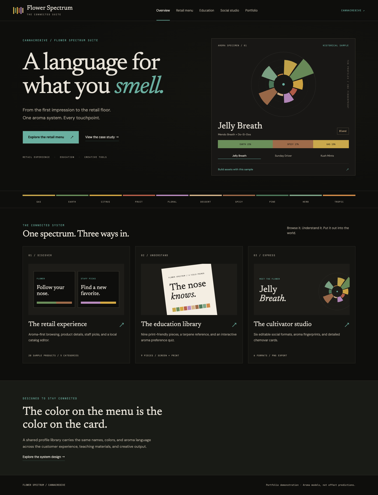
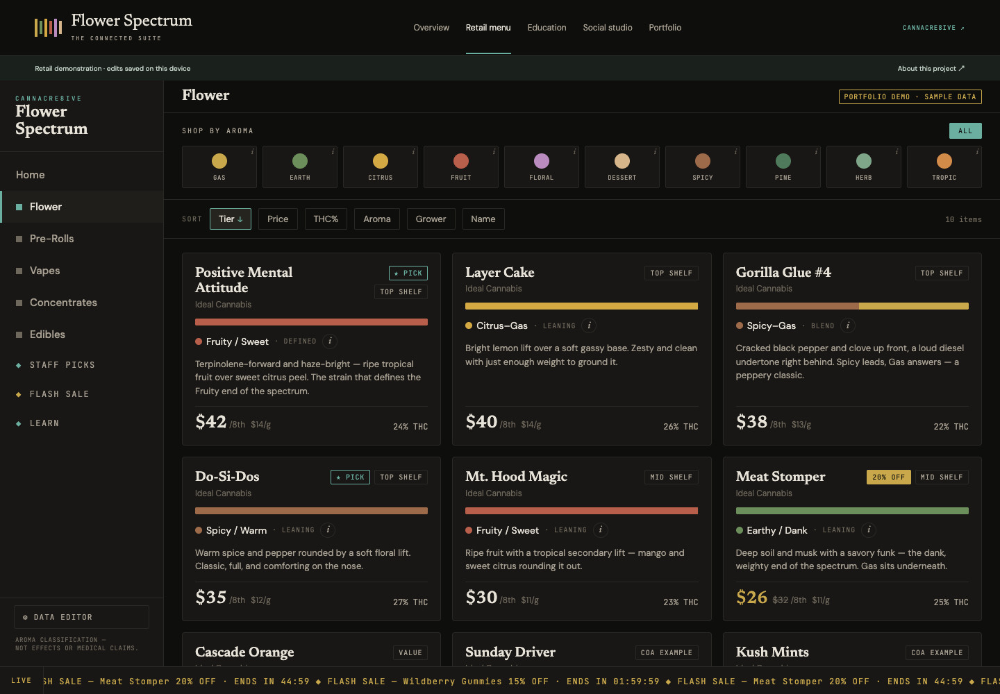
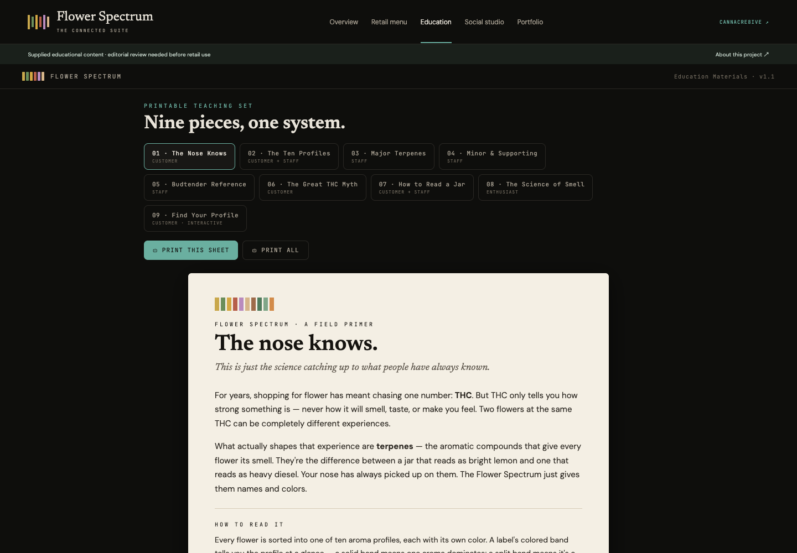
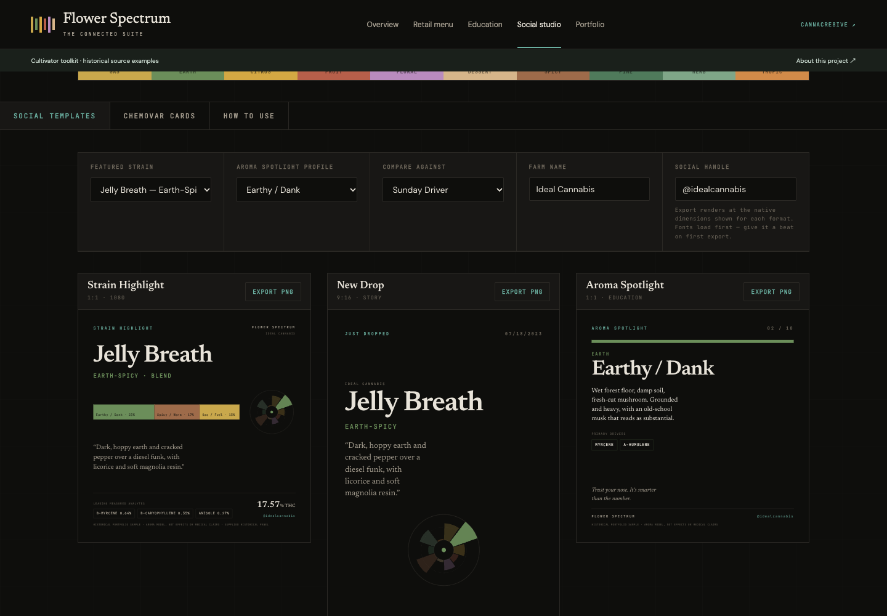

# Flower Spectrum Suite

**[🚀 Live Demo](https://flower-spectrum-suite.vercel.app)** · **[Portfolio & downloads](https://flower-spectrum-suite.vercel.app/#portfolio)** · **[Case study PDF](public/assets/flower-spectrum-case-study.pdf)**

A language for what you smell. A connected retail menu, education library, and cultivator creative studio by CannaCre8ive, synthesized from three supplied prototypes.

## Explore

- **Retail menu:** five product categories, aroma filters, sorting, product details, contextual learning, staff picks, demo sales, and local catalog editing.
- **Education:** nine supplied teaching pieces, individual/full print views, and an interactive preference quiz that links into retail browsing.
- **Social studio:** six customizable PNG formats, three historical sample panels, detailed chemovar cards, and shared profile colors.
- **Portfolio:** a case study, real screenshots, print primer, social examples, and a complete downloadable asset kit.

## Start locally

```bash
npm ci
npm run dev
```

Open the local address shown by Vite. `npm run check` runs source-preservation, classification, and CSV regression checks followed by a production build. `npm run preview` serves the production build. Use Node 22.12+ or a newer supported LTS. No environment variables or credentials required.

## Project organization

| Folder | Purpose |
|---|---|
| `source/` | Exact original HTML/JSX plus SHA-256 manifest |
| `src/data/` | Shared profiles, terpene reference, sample panels, and catalog seeds |
| `src/lib/` | Preserved classification math, CSV handling, local catalog state |
| `src/modules/` | Adapted retail, education, and creative tools |
| `portfolio/` | Editable case study, asset guide, ready-to-use captions |
| `public/assets/` | Downloadable PDF, PNG, and ZIP portfolio deliverables |
| `documentation/assets/` | Real app screenshots |

The React shell lazy-loads the retail and education views. The social canvas has its own HTML entry to preserve its styling while importing shared data modules. Browser catalog changes stay on this device; no server stores or publishes them. Export CSV for backup.

## Preview







## Source and scope

This is a portfolio demonstration, not live inventory or a production retail system. Pricing, staff attributions, and most product values are illustrative. Three historical sample panels were transcribed in the supplied sources; original laboratory PDFs were not included or independently verified. Relative aroma-model scores are not measured terpene concentrations or effect predictions. The broader educational terpene library and compact classifier have different coverage by design. Legacy education copy requires editorial review before retail use.

The application does not upload imported catalogs. It has no authentication, checkout, POS integration, or cloud sync. The source files remain intact. See [SOURCE-MAP](documentation/SOURCE-MAP.md), [ARCHITECTURE](ARCHITECTURE.md), and [ROADMAP](ROADMAP.md).

## Recent updates

**1.0.0:** unified navigation and profile library; connected historical samples; persistent local catalog; CSV field preservation and validation; responsive layout; six native-size social exports; case study and portfolio asset pack; complete social metadata and stable demo link. See [CHANGELOG](CHANGELOG.md).

## Project documentation

[Product requirements](PRD.md) · [Design system](DESIGN.md) · [User flows](USERFLOW.md) · [Testing](TESTING.md) · [Contributing](CONTRIBUTING.md) · [Asset guide](portfolio/ASSET-GUIDE.md)

Source artwork and supplied content remain subject to their owners' rights. No additional open-source license is granted for the supplied creative material.
